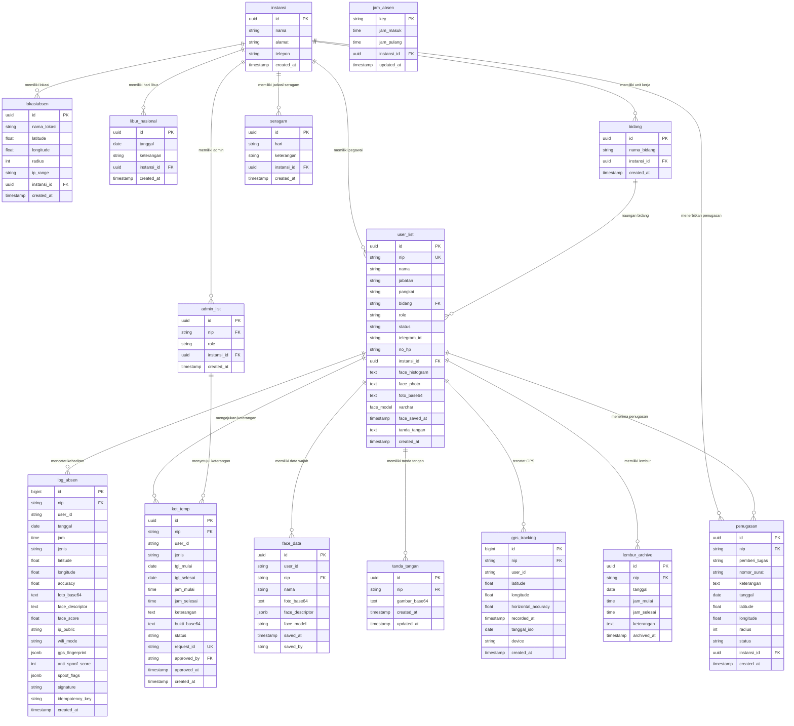

# 📋 Dokumentasi Aplikasi HADIR

**HADIR** — Sistem Absensi Digital berbasis Telegram Mini App & PWA untuk pegawai instansi pemerintah Kabupaten Sumba Barat. Mendukung verifikasi wajah AI, validasi GPS/WiFi kantor, mode offline, dan tersedia sebagai aplikasi Android native via Capacitor.

---

## Daftar Isi

- [1. Arsitektur Aplikasi](#1-arsitektur-aplikasi)
- [2. Fitur & Modul](#2-fitur--modul)
- [3. Alur Absensi](#3-alur-absensi)
- [4. Struktur Database](#4-struktur-database)
- [5. Teknologi & Dependensi](#5-teknologi--dependensi)
- [6. Deployment](#6-deployment)
- [7. Keamanan](#7-keamanan)
- [8. Konfigurasi](#8-konfigurasi)
- [9. Pengembangan](#9-pengembangan)
- [10. Troubleshooting](#10-troubleshooting)

---

## 1. Arsitektur Aplikasi

### 1.1 Diagram Arsitektur

```
┌─────────────────────────────────────────────────────┐
│                  TELEGRAM (Mini App)                  │
│  ┌───────────────────────────────────────────────┐   │
│  │            HADIR Frontend (SPA)               │   │
│  │  Vanilla JS (30+ file modular) + HTML5 + CSS3 │   │
│  │  ┌───────┐ ┌──────┐ ┌──────┐ ┌───────────┐   │   │
│  │  │ Absen  │ │ Izin │ │Rekap │ │  Profil   │   │   │
│  │  ├───────┤ ├──────┤ ├──────┤ ├───────────┤   │   │
│  │  │ Admin │ │Tugas │ │Lembur│ │  SIMAPO   │   │   │
│  │  └───────┘ └──────┘ └──────┘ └───────────┘   │   │
│  └───────────────────────────────────────────────┘   │
└──────────────────────┬──────────────────────────┘
                       │ HTTPS / Webhook
                       ▼
┌─────────────────────────────────────────────────────┐
│              n8n (Self-hosted Workflow)               │
│  Workflow: AbsensiBot V.5.1, face recognition,       │
│  keterangan, tugas_lembur, kirimrekap, SIMAPO        │
└──────────────────────┬──────────────────────────┘
                       │ SQL / REST
                       ▼
┌─────────────────────────────────────────────────────┐
│              Supabase (PostgreSQL)                    │
│  Tables: log_absen, user_list, face_data,            │
│  lokasiabsen, jam_absen, ket_temp, dll.              │
└─────────────────────────────────────────────────────┘
```

### 1.2 Stack Teknologi

| Layer              | Teknologi                                              |
|--------------------|--------------------------------------------------------|
| Frontend           | Vanilla JS (ES Modules), HTML5, CSS3                   |
| AI / Face          | @vladmandic/human v3.2.1 (WebGL/WASM, 512-dim)        |
| Peta & GPS         | Leaflet.js                                             |
| Date Picker        | Flatpickr                                              |
| PDF Export         | jsPDF + jsPDF-AutoTable                                |
| Excel Export       | SheetJS (xlsx.full.min)                                |
| Notifikasi UI      | SweetAlert2                                            |
| Telegram SDK       | Telegram Web App SDK                                   |
| Backend/API        | n8n webhook (self-hosted) → Supabase PostgreSQL        |
| Offline Storage    | IndexedDB (via idb helper)                             |
| Mobile App         | Capacitor v8 (Android)                                 |
| OTA Update         | Capgo (CapacitorUpdater)                               |
| CI/CD              | GitHub Actions (build APK otomatis)                    |
| PWA                | Service Worker + Web App Manifest                      |

### 1.3 Struktur Direktori

```
absensi_refactored_v6/
├── index.html                  # Entry point SPA — semua panel dalam 1 file
├── service-worker.js           # PWA Service Worker (Network First)
├── manifest.json               # Web App Manifest (PWA)
├── capacitor.config.json       # Konfigurasi Capacitor Android
├── package.json                # Dependencies (Capacitor, pg)
│
├── css/
│   ├── styles.css              # Stylesheet utama (dark theme, component styles)
│   ├── lib/                    # CSS library: Leaflet, Flatpickr dark, FontAwesome
│   └── webfonts/               # FontAwesome icon fonts
│
├── js/
│   ├── app.js                  # InitApp — bootstrap & startup sequence
│   ├── config.js               # Server config, P.* endpoints, idb, apiFetch
│   ├── constants.js            # Konstanta: timezone, threshold, JENIS_ABSEN
│   ├── state.js                # State global (State.user, State.ai, etc.)
│   ├── auth.js                 # Login/Register/Logout + face verification login
│   ├── api.js                  # apiGet, apiPost, apiUpload helpers
│   ├── network.js              # Deteksi koneksi, IP cache, permissions API
│   ├── offline.js              # Offline queue sync via IndexedDB + PWA register
│   ├── face.js                 # Face recognition engine (Human.js + BlazeFace)
│   ├── meja.js                 # Mode Meja Absen (1:N face matching)
│   ├── meja-handler.js         # Event handler UI Meja Absen
│   ├── absen.js                # Logic absen masuk/pulang + GPS + anti-spoofing
│   ├── keterangan.js           # Pengajuan izin/sakit/tugas + offline queue
│   ├── rekap.js                # Rekap absensi + filter + statistik
│   ├── rekap-pdf.js            # Export PDF dengan jsPDF + autotable
│   ├── tugas_lembur.js         # Modul penugasan dinas & lembur
│   ├── signature.js            # Tanda tangan digital (canvas-based)
│   ├── profil.js               # Profil pegawai + dokumen + face status
│   ├── log.js                  # Riwayat absen + filter + akumulasi
│   ├── weather.js              # Widget cuaca real-time
│   ├── desktop.js              # Mode tampilan desktop (widescreen)
│   ├── ui.js                   # Helper UI: toast, result, shimmer
│   ├── dom.js                  # Utility DOM: $(), qs, createElement
│   ├── helpers.js              # Compress image, format date, etc.
│   ├── errors.js               # Error handling terpusat + ERROR_CODES
│   ├── debug.js                # Panel debug untuk admin
│   ├── admin.js                # Panel admin operasional
│   ├── admin-pegawai.js        # CRUD data pegawai
│   ├── admin-lokasi-v9.js      # Manajemen lokasi absen
│   ├── admin-face.js           # Registrasi wajah via admin
│   ├── admin-libur.js          # Manajemen hari libur
│   ├── admin-log.js            # Edit manual riwayat absen
│   ├── admin-mgmt.js           # Manajemen role admin
│   ├── admin-seragam.js        # Jadwal seragam harian
│   ├── simapo.js               # SIMAPO user: katalog, peminjaman, tiket
│   ├── simapo-admin.js         # SIMAPO admin: pinjaman, tiket, master
│   ├── simapo-ext.js           # SIMAPO extended: mutasi stok, opname, kategori
│   └── lib/                    # Library vendor: Flatpickr, jsPDF, Leaflet, dll.
│
├── n8n/
│   ├── AbsensiBot V.5.1.json   # Workflow utama absensi
│   ├── face recognition wf.json # Workflow face register/get
│   ├── Ket absensi wf.json     # Workflow keterangan/izin
│   ├── tugas_lembur_wf.json    # Workflow penugasan & lembur
│   ├── kirimrekapabsen.json    # Kirim rekap ke Telegram
│   ├── notifabsen.json         # Notifikasi absen masuk/pulang
│   ├── lembur_archive_workflow.json
│   ├── Absensi Dok Pegawai.json
│   ├── header_instansi_wf.json
│   └── simapo/                 # 6 workflow SIMAPO terpisah
│       ├── 01_katalog_master_barang.json
│       ├── 02_peminjaman.json
│       ├── 03_tiket_kerusakan.json
│       ├── 04_mutasi_stok.json
│       ├── 05_stok_opname.json
│       └── 06_kategori_barang.json
│
├── scripts/
│   ├── migration_001_critical_fixes.sql
│   ├── migration_002_security_fk.sql
│   ├── migration_003_gps_tracking.sql
│   └── setup-capacitor.js      # Setup CI/CD untuk build APK
│
├── android/                    # Native Android project (Capacitor)
│   └── app/src/main/java/.../MainActivity.java
│
├── .github/workflows/
│   └── build-apk.yml           # GitHub Actions — auto build APK
│
└── www/                        # Build output (gitignored)
```

### 1.4 Alur Inisialisasi Aplikasi

```
DOMContentLoaded
       │
       ▼
  initApp()
       │
       ├── fetchInstansiList()
       ├── _checkIdentityOnLoad()
       │     └── Jika tidak ada MY_ID → tampilkan authOverlay
       │
       ├── idb.init() (IndexedDB)
       ├── loadFaceToggle()
       ├── loadJamAbsen()
       ├── loadUserProfile()
       ├── loadTodayHistory()
       ├── fetchJamPeriode()
       ├── updateClock() (real-time clock WITA)
       ├── applyAdminVisibility()
       │
       └── setTimeout(1500ms)
             ├── loadFaceFromServer()
             ├── loadBidangList()
             ├── _prewarmHumanInBackground() (Human.js warmup)
             ├── _cekWajibFace()
             └── switchTab(lastTab)
```

---

## 2. Fitur & Modul

### 2.1 Absensi Pegawai

Fitur utama di tab **Absen** (`panel-absen`):

| Komponen           | Deskripsi                                          |
|--------------------|----------------------------------------------------|
| Clock & Weather    | Jam real-time WITA + widget cuaca dari lokasi      |
| User Info & GPS    | Kartu profil user + daftar lokasi terdeteksi       |
| GPS Satelit        | Lat/Lon, akurasi, alamat, progress bar akurasi     |
| WiFi/IP Check      | Deteksi jaringan & IP publik, validasi server-side |
| Log Hari Ini       | Riwayat absen hari ini (muncul setelah absen)      |
| Tombol Absen       | Trigger utama: buka kamera → GPS → kirim payload   |
| Pulang dari Lapangan | Khusus pegawai di lapangan                        |
| Ajukan Izin        | Pintasan ke tab Keterangan/Izin                    |

**Alur absen detail:**

```
Tekan "Kirim Lokasi & Absen"
       │
       ├── Validasi: desktop? → tolak
       ├── Validasi: identity undefined? → tolak
       ├── Validasi: sudah punya keterangan hari ini? → blokir
       ├── Cek jaringan (cekJaringan) → fetch IP publik
       ├── Cek face recognition:
       │     ├── Enabled & online → buka kamera (openCamOverlay)
       │     │     ├── Load BlazeFace model (cached)
       │     │     ├── Loop deteksi: wajah → liveness → warna baju
       │     │     ├── doCapture() → foto + compress + descriptor
       │     │     └── callback ke _doAbsenWithGPS()
       │     └── Disabled / offline → langsung _doAbsenWithGPS()
       │
       └── _doAbsenWithGPS():
             ├── Collect DeviceMotion (anti-emulator, 1.5s)
             ├── navigator.geolocation.getCurrentPosition()
             ├── Multi-layer fake GPS detection (8 layers)
             ├── Reverse geocode (Nominatim)
             ├── Generate HMAC signature
             ├── Build payload:
             │     ├── user_id, nip, nama
             │     ├── latitude, longitude, accuracy
             │     ├── gps_fingerprint (altitude, speed, heading, dll)
             │     ├── anti_spoof_score, spoof_flags
             │     ├── foto_base64, face_descriptor
             │     ├── ip_public, wifi_mode
             │     ├── jenis (MASUK/PULANG), jam, tanggal
             │     ├── signature (SHA-256 HMAC)
             │     └── initData Telegram
             ├── apiPost(P.absen, payload) → n8n webhook
             └── Tampilkan resultCard
```

### 2.2 Izin & Keterangan

Fitur di tab **Izin** (`panel-ket`):

| Fitur               | Detail                                              |
|---------------------|-----------------------------------------------------|
| Jenis Keterangan    | IZIN, SAKIT, TUGAS, TUBEL, CUTI                     |
| Izin Per Jam        | Jam parsial (mis. 08:00-10:00)                      |
| Rentang Tanggal     | Flatpickr range picker                              |
| Upload Bukti        | Kamera atau galeri (foto/PDF, max 5MB)              |
| Riwayat Pengajuan   | Status PENDING / DISETUJUI / DITOLAK                |
| Edit/Hapus          | Selama masih PENDING                                 |
| Offline Queue       | Tersimpan di IndexedDB, terkirim saat online kembali |

**Alur approval:**
- **SAKIT** & **TUGAS** → auto-approve + broadcast ke grup Telegram
- **IZIN** →但gu persetujuan admin, lalu broadcast
- Admin bisa approve/tolak via Panel Admin > Operasional > Konfirmasi Keterangan

### 2.3 Meja Absen (1:N Face Matching)

Mode **Meja Absen** untuk identifikasi otomatis tanpa input manual:

- Kamera statis di meja/lobi kantor
- Passive liveness detection via Human.js
- 1:N matching dengan seluruh database wajah pegawai
- Cache database wajah di IndexedDB untuk startup instan
- Cooldown 20 detik antar-match
- Threshold kemiripan: 0.55 (Euclidean distance)
- Notifikasi suara via Telegram Bot

### 2.4 Rekap & Laporan

| Fitur               | Detail                                              |
|---------------------|-----------------------------------------------------|
| Period              | Hari Ini, Minggu Ini, Bulan Ini, 30 Hari, Kustom   |
| Filter              | Bidang, Instansi (superadmin), Role (pegawai/magang)|
| Statistik Baris 1   | Masuk, Pulang, Lapangan, Lambat                     |
| Statistik Baris 2   | Izin, Sakit, Tugas, Tubel, Cuti, TB                |
| Export Excel        | SheetJS (xlsx.full.min)                             |
| Export PDF          | jsPDF + AutoTable + tanda tangan digital            |
| Kirim ke Telegram   | Via workflow n8n `kirimrekapabsen.json`             |

### 2.5 Penugasan & Lembur

**Penugasan Dinas** (`panel-tugas`):
- Admin/Kabid dapat membuat penugasan untuk pegawai
- Pilih pegawai via searchable dropdown multi-select
- Tentukan titik koordinat & radius tugas
- Pegawai konfirmasi dengan bukti foto di lokasi tugas
- Monitoring progres oleh atasan

**Rekap Lembur** (`panel-lembur`):
- Pilih rentang tanggal + pegawai
- Tarik data absen otomatis
- Deteksi konflik dengan penugasan
- Arsip rekap lembur

### 2.6 SIMAPO (Sistem Inventaris)

Modul manajemen aset terintegrasi:

| Sub-modul  | User                               | Admin                               |
|------------|------------------------------------|-------------------------------------|
| Katalog    | Lihat barang, filter kategori      | CRUD master barang                  |
| Peminjaman | Ajukan pinjam, riwayat peminjaman  | Setujui/tolak/kembalikan            |
| Tiket      | Lapor kerusakan aset               | Kelola tiket kerusakan              |
| Mutasi     | —                                  | Catat mutasi stok (masuk/keluar)    |
| Opname     | —                                  | Verifikasi fisik aset               |
| Kategori   | —                                  | Manajemen kategori barang           |

### 2.7 Panel Admin

| Bagian              | Fungsi                                               |
|---------------------|------------------------------------------------------|
| **Operasional**     | Konfirmasi keterangan, input keterangan manual       |
| **Kepegawaian**     | CRUD pegawai, manage bidang, instansi                |
| **Konfigurasi**     | Lokasi (radius, CIDR), Jam absen, Hari libur,        |
|                     | Registrasi wajah, Log absen, Manajemen admin,        |
|                     | Seragam, Dokumen pegawai                             |
| **Inventaris**      | Pinjaman, tiket, master aset, mutasi, opname, kategori|

### 2.8 Fitur Lainnya

| Fitur               | Detail                                              |
|---------------------|-----------------------------------------------------|
| **Profil**          | Foto profil, jabatan, pangkat, status, face status   |
| **Dokumen**         | Upload/download dokumen kepegawaian (PDF/gambar)     |
| **Tanda Tangan**    | Canvas signature pad → PNG transparan                |
| **Pengingat KP**    | Kenaikan pangkat & berkala                           |
| **Riwayat Absen**   | Filter jenis, akumulasi waktu, peta lokasi           |
| **Cuaca**           | Widget real-time dari OpenWeatherMap                 |
| **Debug Mode**      | Panel diagnostik teknis untuk admin                  |
| **GPS Tracking**    | Pemantauan lokasi periodik (setiap 5 menit)          |

---

## 3. Alur Absensi

### 3.1 Flowchart Absen Masuk/Pulang

```
                START
                  │
                  ▼
         ┌─────────────────┐
         │  Buka HADIR via  │
         │ Telegram Mini App │
         └────────┬─────────┘
                  │
                  ▼
         ┌─────────────────┐
         │ Login (NIP +    │
         │ Face Verify)    │
         └────────┬─────────┘
                  │
                  ▼
         ┌─────────────────┐
         │ Tab ABSEN       │
         │ → Lihat jam     │
         │ → Deteksi GPS   │
         │ → Cek WiFi/IP   │
         └────────┬─────────┘
                  │
                  ▼
         ┌─────────────────┐
         │ Tekan "Kirim    │
         │ Lokasi & Absen" │
         └────────┬─────────┘
                  │
        ┌─────────┴──────────┐
        ▼                    ▼
  ┌──────────────┐   ┌──────────────┐
  │Face ON       │   │Face OFF      │
  │→ Buka kamera │   │→ Skip cam    │
  │→ Deteksi     │   └──────┬───────┘
  │→ Liveness    │          │
  │→ Ambil foto  │          │
  └──────┬───────┘          │
         │                  │
         └──────┬───────────┘
                ▼
       ┌─────────────────┐
       │ GPS Acquisition │
       │ + Anti-spoofing │
       └────────┬─────────┘
                │
                ▼
       ┌─────────────────┐
       │ Reverse Geocode │
       │ (Nominatim)     │
       └────────┬─────────┘
                │
                ▼
       ┌─────────────────┐
       │ Generate HMAC   │
       │ Signature       │
       └────────┬─────────┘
                │
                ▼
       ┌─────────────────┐
       │ POST ke n8n     │
       │ /webhook/absen  │
       └────────┬─────────┘
                │
                ▼
       ┌─────────────────┐
       │ n8n: Simpan ke  │
       │ Supabase        │
       │ + Broadcast     │
       └────────┬─────────┘
                │
                ▼
       ┌─────────────────┐
       │ Tampilkan Result│
       │ + Refresh Log   │
       └─────────────────┘
```

### 3.2 Verifikasi Wajah (Face Recognition)

Menggunakan **@vladmandic/human** dengan 512-dim descriptor:

1. **Prewarm**: Model dimuat di background saat startup (setelah 3 detik)
2. **Open kamera**: Stream kamera belakang dengan zoom (hardware + CSS)
3. **Deteksi loop**: Frame-by-frame face detection + liveness
4. **Liveness**: Deteksi kedip mata + gerakan geleng kepala
5. **Capture**: Foto diambil otomatis saat wajah stabil + liveness OK
6. **Compress**: Foto dikompres ke max 800px, quality 0.7
7. **Extract descriptor**: 512-dim vector dari Human.js
8. **Match**: Cosine similarity dengan descriptor tersimpan (threshold 0.55)
9. **Sync**: Foto + descriptor dikirim ke server via n8n

### 3.3 Validasi GPS & Anti-Spoofing

Multi-layer fake GPS detection (8 layers):
1. **User-Agent pattern**: Cek apakah dari Telegram resmi
2. **Accuracy pattern**: Akurasi bulat mencurigakan (1, 2, 3, 5m)
3. **Acquisition speed**: GPS terlalu instan (< 50ms)
4. **Akurasi out-of-range**: ≤ 0m atau > 500m
5. **Koordinat presisi**: Trailing zeros mencurigakan
6. **Altitude check**: Tidak ada altitude atau nilai bulat
7. **Speed anomaly**: Speed 0 instan atau > 28 m/s
8. **GPS Timestamp**: Waktu GPS vs system time

Skor 0–100. ≥ 50 → ditolak, 30–49 → suspicious (warning).

Dilengkapi **DeviceMotion data** (accelerometer samples) sebagai anti-emulator.

---

## 4. Struktur Database

### 4.1 Tabel Utama

| Tabel              | Fungsi                                           | Key                |
|--------------------|--------------------------------------------------|--------------------|
| `log_absen`        | Riwayat absensi harian pegawai                   | id, nip, tanggal   |
| `user_list`        | Data master pegawai                              | id, nip, instansi  |
| `lokasiabsen`      | Konfigurasi lokasi & IP range WiFi kantor        | id, instansi       |
| `jam_absen`        | Konfigurasi jam masuk/pulang (key: jam_absen_global)| key              |
| `ket_temp`         | Pengajuan keterangan/izin sementara              | id, nip            |
| `face_data`        | Descriptor wajah & foto pegawai                  | user_id            |
| `tanda_tangan`     | Data tanda tangan digital (PNG base64)           | nip                |
| `libur_nasional`   | Daftar hari libur                                | tanggal, instansi  |
| `admin_list`       | Daftar NIP admin & role                          | nip, instansi      |
| `instansi`         | Data instansi (multi-tenant)                     | id                 |
| `penugasan`        | Penugasan dinas luar                             | id                 |
| `lembur_archive`   | Arsip data lembur                                | id                 |
| `gps_tracking`     | Riwayat pelacakan GPS periodik                   | nip, tanggal_iso   |
| `seragam`          | Jadwal seragam harian                            | hari, instansi     |
| `bidang`           | Daftar bidang/unit kerja                         | id, instansi       |

### 4.2 Field Penting per Tabel

**log_absen**:
- `id`, `nip`, `user_id`, `tanggal`, `jam`, `jenis` (MASUK/PULANG/PULANG LUAR)
- `latitude`, `longitude`, `accuracy`
- `foto_base64`, `face_descriptor`, `face_score`
- `ip_public`, `wifi_mode`
- `gps_fingerprint` (JSON), `anti_spoof_score`, `spoof_flags`
- `signature`, `idempotency_key`
- `created_at`, `updated_at`

**user_list**:
- `id`, `nip`, `nama`, `jabatan`, `pangkat`, `bidang`
- `telegram_id`, `no_hp`, `role` (USER/ADMIN/SUPERADMIN/KEPALA)
- `status` (AKTIF/TIDAK AKTIF)
- `instansi_id`, `face_histogram`, `face_photo`, `foto_base64`
- `face_model`, `face_saved_at`
- `tanda_tangan`, `created_at`

**ket_temp**:
- `id`, `nip`, `user_id`, `jenis` (IZIN/SAKIT/TUGAS/TUBEL/CUTI)
- `tgl_mulai`, `tgl_selesai`, `jam_mulai`, `jam_selesai`
- `keterangan`, `bukti_base64`
- `status` (PENDING/DISETUJUI/DITOLAK)
- `request_id` (idempotency key)
- `approved_by`, `approved_at`

**face_data**:
- `user_id`, `nip`, `nama`
- `foto_base64`, `face_descriptor` (512-dim array)
- `face_model` (human/faceapi)
- `saved_at`, `saved_by`

---

## 4.3 Entity Relationship Diagram (ERD)



### 4.4 Relasi Antar Tabel

| Tabel Sumber       | Tabel Tujuan        | Relasi             | Key                         |
|--------------------|---------------------|--------------------|-----------------------------|
| `user_list`        | `instansi`          | N:1 (induk)        | `instansi_id` → `id`        |
| `log_absen`        | `user_list`         | N:1                | `nip` → `nip`               |
| `ket_temp`         | `user_list`         | N:1                | `nip` → `nip`               |
| `ket_temp`         | `admin_list`        | N:1                | `approved_by` → `nip`       |
| `face_data`        | `user_list`         | N:1                | `nip` → `nip`               |
| `tanda_tangan`     | `user_list`         | N:1                | `nip` → `nip`               |
| `gps_tracking`     | `user_list`         | N:1                | `nip` → `nip`               |
| `lembur_archive`   | `user_list`         | N:1                | `nip` → `nip`               |
| `penugasan`        | `user_list`         | N:1                | `nip` → `nip`               |
| `admin_list`       | `user_list`         | N:1                | `nip` → `nip`               |
| `admin_list`       | `instansi`          | N:1                | `instansi_id` → `id`        |
| `lokasiabsen`      | `instansi`          | N:1                | `instansi_id` → `id`        |
| `jam_absen`        | `instansi`          | N:1                | `instansi_id` → `id`        |
| `libur_nasional`   | `instansi`          | N:1                | `instansi_id` → `id`        |
| `seragam`          | `instansi`          | N:1                | `instansi_id` → `id`        |
| `bidang`           | `instansi`          | N:1                | `instansi_id` → `id`        |
| `user_list`        | `bidang`            | N:1                | `bidang` → `nama_bidang`    |

### 4.5 Ringkasan

**14 tabel** dengan 2 tabel inti (`instansi` sebagai root multi-tenant, `user_list` sebagai pusat data pegawai).

- `instansi` → root tenant. Semua data di-scope per instansi.
- `user_list` → pusat data pegawai. Dirujuk oleh 7+ tabel lain via `nip`.
- `log_absen` → tabel terbesar. 1 baris per event absen (masuk/pulang).
- `ket_temp` → tabel transaksional untuk workflow approval izin.
- `face_data` → menyimpan 512-dim face descriptor untuk verifikasi AI.
- `gps_tracking` → pelacakan lokasi periodik (setiap 5 menit).

---

## 5. Teknologi & Dependensi

### 5.1 Frontend Libraries

| Library               | Versi    | Lokasi             | Fungsi                    |
|-----------------------|----------|---------------------|---------------------------|
| @vladmandic/human     | 3.2.1    | CDN (dynamic)       | Face recognition engine   |
| Leaflet.js            | min      | js/lib/             | Peta interaktif           |
| Flatpickr             | min      | js/lib/             | Date range picker         |
| jsPDF                 | umd      | js/lib/             | PDF generation            |
| jsPDF-AutoTable       | plugin   | js/lib/             | PDF table                 |
| SheetJS (xlsx)        | full.min | js/lib/             | Excel export              |
| SweetAlert2           | all.min  | js/lib/             | Notifikasi & dialog       |
| FontAwesome           | 6.x min  | css/lib/            | Icons                     |
| Telegram Web App SDK  | latest   | js/lib/             | Telegram Mini App bridge  |

### 5.2 Backend (n8n Workflows)

Workflow utama: **AbsensiBot V.5.1.json** — menangani:
- Validasi IP publik (CIDR check via tabel lokasiabsen)
- Verifikasi HMAC signature
- Anti-duplikasi (idempotency key)
- Insert ke Supabase
- Broadcast notifikasi ke grup Telegram
- Hitung keterlambatan & pulang cepat

### 5.3 Mobile (Capacitor Android)

| Plugin                    | Versi   | Fungsi                    |
|---------------------------|---------|---------------------------|
| @capacitor/core           | ^8.3.4  | Core Capacitor            |
| @capacitor/cli            | ^8.3.4  | CLI tools                 |
| @capacitor/android        | ^8.3.4  | Android platform          |
| @capacitor/filesystem     | ^8.1.2  | File system access        |
| @capacitor/share          | ^8.0.1  | Share API                 |
| @capgo/capacitor-updater  | ^8.46.1 | OTA update via Capgo      |

**MainActivity.java** dilengkapi proteksi: blokir aplikasi jika **Developer Options** atau **USB Debugging** aktif.

---

## 6. Deployment

### 6.1 Mode Deployment

| Mode                 | Channel                         | Autentikasi              |
|----------------------|---------------------------------|--------------------------|
| **Telegram Mini App** | BotFather → URL                | tg.initData              |
| **PWA**              | Browser + manifest.json         | Login NIP + Face Verify  |
| **Android APK**      | Capacitor build → distribusi    | Login NIP + Face Verify  |

### 6.2 Build Android APK

**Manual:**
```bash
npm install
node scripts/setup-capacitor.js
npx cap sync
npx cap copy android
cd android && .\gradlew assembleDebug
```
Output: `android/app/build/outputs/apk/debug/app-debug.apk`

**Auto (GitHub Actions):**
Push ke `main`/`master` → trigger `.github/workflows/build-apk.yml` → APK tersedia di Actions artifact.

### 6.3 OTA Update (Capgo)

- App menggunakan Capgo untuk update over-the-air
- `CAPGO_TOKEN` di GitHub Secrets
- `CapacitorUpdater.notifyAppReady()` dipanggil di `app.js` setelah startup sukses

### 6.4 Web (Telegram Mini App)

1. Hosting file statis ke web server / Vercel / Netlify
2. Daftarkan URL sebagai Telegram Mini App via BotFather
3. Isi konfigurasi di `js/config.js`:
   - `SERVER_1`, `SERVER_2` (n8n base URLs)
   - `API_TOKEN`
   - `WIFI_CHECK_ENABLED`
4. Import workflow n8n dari folder `n8n/`
5. Jalankan migrasi SQL di Supabase

---

## 7. Keamanan

### 7.1 Authentication

| Layer           | Metode                                                |
|-----------------|-------------------------------------------------------|
| Telegram        | `tg.initData` — HMAC-validated by Telegram servers    |
| NIP Login       | Face verification (passwordless)                      |
| Face Verify     | Cosine similarity with stored 512-dim descriptor      |
| Webhook Token   | `X-App-Token` header pada setiap request ke n8n       |
| SIMAPO Token    | `Authorization: Bearer` + dedicated token             |

### 7.2 Anti-Spoofing

| Aspek           | Implementasi                                          |
|-----------------|-------------------------------------------------------|
| GPS             | 8-layer detection, DeviceMotion, acceleration samples |
| Face            | Liveness detection (blink + head movement)            |
| IP              | Server-side CIDR validation via `lokasiabsen` table   |
| Payload         | HMAC SHA-256 signature                                |
| Duplikasi       | `idempotency_key` per request                         |
| Debug Mode      | Android: block if Developer Options aktif             |

### 7.3 Validasi Server-side (n8n)

- IP publik pegawai dicocokkan dengan CIDR di tabel `lokasiabsen`
- Face descriptor diverifikasi dimensinya (512-d untuk Human.js)
- GPS anti-spoofing score dihitung & dicatat
- Duplikasi absen dicegah via idempotency key

---

## 8. Konfigurasi

### 8.1 `js/config.js`

```js
const SERVER_1 = 'https://mindcloud.my.id';          // Server utama
const SERVER_2 = 'https://...sumopod.my.id';          // Fallback
const API_TOKEN = 'BAPPERIDA_SECURE_TOKEN_2025';       // Token webhook
const WIFI_CHECK_ENABLED = true;                       // Validasi IP
const isTest = false;                                  // Mode test webhook
```

### 8.2 `js/constants.js`

```js
const FACE_THRESHOLD       = 0.55;  // Threshold matching wajah
const GPS_MAX_ACCURACY_M   = 500;   // Akurasi GPS maks (meter)
const GPS_FAKE_SCORE_THRESHOLD = 30; // Skor anti-spoofing
const MEJA_COOLDOWN_MS     = 20000; // Cooldown Meja Absen
const JAM_MASUK_DEFAULT    = '08:00';
const JAM_PULANG_DEFAULT   = '14:30';
```

### 8.3 Endpoint (`const P = { ... }`)

Semua endpoint di `config.js` mengikuti pola:
- Production: `/webhook/{nama-endpoint}`
- Test: `/webhook-test/{nama-endpoint}` (saat `isTest = true`)

Key endpoints:
- `P.absen` → POST absen masuk/pulang
- `P.ket` → POST keterangan/izin
- `P.log` → GET riwayat absen
- `P.rekap` → GET data rekap
- `P.faceRegister` → POST registrasi wajah
- `P.faceGet` → GET data wajah
- `P.userList` → GET data pegawai
- `P.lokasiList` → GET lokasi absen
- 60+ endpoints total

---

## 9. Pengembangan

### 9.1 Codebase Notes

- Proyek hasil refactoring dari monolith HTML (~15.000 baris) menjadi modular 30+ file JS
- Backend bertahap migrasi dari n8n ke Supabase direct
- Face recognition: face-api.js (128-dim) → @vladmandic/human (512-dim)
  - Descriptor lama harus didaftarkan ulang
- `isTest = false` di config.js — ubah ke `true` untuk test webhook
- Semua state global via `State` object di `state.js`

### 9.2 Convention

| Aspek              | Convention                                          |
|--------------------|-----------------------------------------------------|
| Timezone           | WITA (Asia/Makassar)                                |
| Face Engine        | @vladmandic/human (dim 512)                         |
| API Response       | Parsing fleksibel (`parseApiResponse`) untuk berbagai format n8n |
| Error Handling     | `ERROR_CODES` + `handleAbsenError()`                |
| Storage            | IndexedDB (offline), localStorage (cache)            |
| Naming             | snake_case untuk DB, camelCase untuk JS              |

### 9.3 Script SQL Migrations

| File                                     | Isi                                |
|------------------------------------------|------------------------------------|
| `migration_001_critical_fixes.sql`       | Fix constraint & indexing          |
| `migration_002_security_fk.sql`          | Foreign key & security             |
| `migration_003_gps_tracking.sql`         | Tabel gps_tracking                 |

---

## 10. Troubleshooting

### 10.1 Masalah Umum

| Masalah                      | Penyebab & Solusi                                   |
|------------------------------|-----------------------------------------------------|
| Kamera tidak muncul          | Izin kamera belum diberikan. Cek settings browser.  |
| GPS error                    | Izin lokasi ditolak. Aktifkan lokasi di pengaturan. |
| "Dibuka via Telegram"        | App dibuka di browser biasa, bukan Telegram Mini App|
| Face match gagal             | Threshold 0.55 terlalu ketat. Posisikan wajah lurus |
| Face descriptor mismatch     | Migrasi face-api → Human. Daftarkan ulang wajah.    |
| Offline data tidak terkirim  | Cek koneksi. Queue otomatis sync saat online kembali.|
| "Akses ditolak"              | IP publik tidak sesuai CIDR kantor. Gunakan WiFi    |
| APK build error              | Setup ulang dengan `node scripts/setup-capacitor.js`|
| Webhook timeout              | n8n down. Cek status server atau fallback ke SERVER_2|

### 10.2 Error Codes

| Code                | Deskripsi                           |
|---------------------|-------------------------------------|
| GPS_UNAVAILABLE     | Geolocation tidak tersedia          |
| GPS_DENIED          | Izin lokasi ditolak                 |
| GPS_TIMEOUT         | Timeout获取 lokasi                  |
| FAKE_GPS            | Terdeteksi fake GPS                 |
| FACE_NO_MATCH       | Wajah tidak cocok                   |
| FACE_NO_DATA        | Data wajah tidak ditemukan          |
| NETWORK_OFFLINE     | Perangkat offline                   |
| IP_BLOCKED          | IP tidak dalam CIDR kantor          |

### 10.3 Debug Mode

Panel diagnotik untuk admin:
- Status koneksi & IP publik
- Cache localStorage
- Status model AI
- GPS data
- Face descriptor cache
- Ada di `js/debug.js`, diakses dari panel Admin

---

## 11. Multi-Tenant (Instansi)

Aplikasi mendukung **multi-tenant** via `instansi_id`:

- Superadmin dapat memilih instansi dari dropdown di setiap tab
- `getScopedInstansiId()` → menentukan instansi aktif berdasarkan konteks
- Setiap request API otomatis menyertakan `instansi_id`
- Data antar-instansi terisolasi (filter by `instansi_id`)

**Prioritas scoping:**
1. Dropdown eksplisit (Superadmin)
2. Persistent storage (`MY_INSTANSI`)
3. URL parameter (`?instansi=`)
4. User profile live state
5. Cache localStorage

---

## 12. Catatan Versi

| Versi | Tanggal       | Perubahan                                          |
|-------|---------------|-----------------------------------------------------|
| v6    | 2026          | Refactor monolith → modular, Human.js 512-dim,      |
|       |               | Multi-tenant, GPS tracking, SIMAPO, anti-spoofing v3|
| v5    | 2025          | Face recognition, offline queue, Telegram Mini App  |
| v4    | 2025          | Admin panel, rekap PDF/Excel                        |
| v3    | 2024          | GPS validation, n8n backend                         |
| v2    | 2024          | PWA + Capacitor Android                             |
| v1    | 2024          | Initial release (monolith)                          |

---

## 13. Kontak

Dikembangkan untuk **BAPPERIDA Kabupaten Sumba Barat**, Nusa Tenggara Timur.

App ID Android: `com.bapperida.absensi`
Repository: `D:\Code\absensi_refactored_v6`
